# Banking System 🏦

## Preview, I hope you enjoy it 😊
1. This project uses jdk 11, JDBC driver, MySQL, Swing;
2. Project consists of 3 levels such as: ui, domain, dao;
3. Project uses Swing interface;
4. Project uses db mySql to store information.
5. Project uses encryption sh256 for login and password user.
6. System can be extended.
7. For testing the system uses JUnit4.
8. System uses Log4j.

## Features
☑️Sing in;
<br>☑️Registration;
<br>☑️Menu acts;
<br>☑️Replenishment of the account on the card;
<br>☑️Withdrawing money from the card;
<br>☑️Opportunity to take out a loan;
<br>☑️Money transfer;
<br>☑️Replenishment of mobile;
<br>☑️Create new card;
<br>☑️Add addition phone;
<br>☑️Check amount on the card;
<br>☑️Check amount on the phone.

## Launch guide
To run this project you will need to install:

JDK 11 or higher
MySQL RDBMS

If you have downloaded a project and want to run it with your own database then you have to create enum which will be stored in a package src/guru/work/prog/dataenv and put your environment variables.
```java
public enum Environment {
    DB_URL("jdbc:RDBMS//host:port/nameDB"),
    USERNAME("username"),
    PASSWORD("password");

    private final String environmentValue;

    Environment(String environmentValue) {
        this.environmentValue = environmentValue;
    }

    public String getEnvironmentValue() {
        return environmentValue;
    }
}
```

Here are the steps for you to follow:

- Add this project to your IDE as Maven project.
- If necessary, configure Java SDK 11 in Project Structure settings.
- You can change path to your log file and  its name in src/main/resources/log4j.properties on line 9.
- First, you will need to register as a new user.
- By default, the USER role is assigned to all registered users.

## Database
You can download database from this project. 
<br>The Sql file is in this path: "src/main/resources/sql/".
<br><i><b>Visually it looks like this:</b></i>
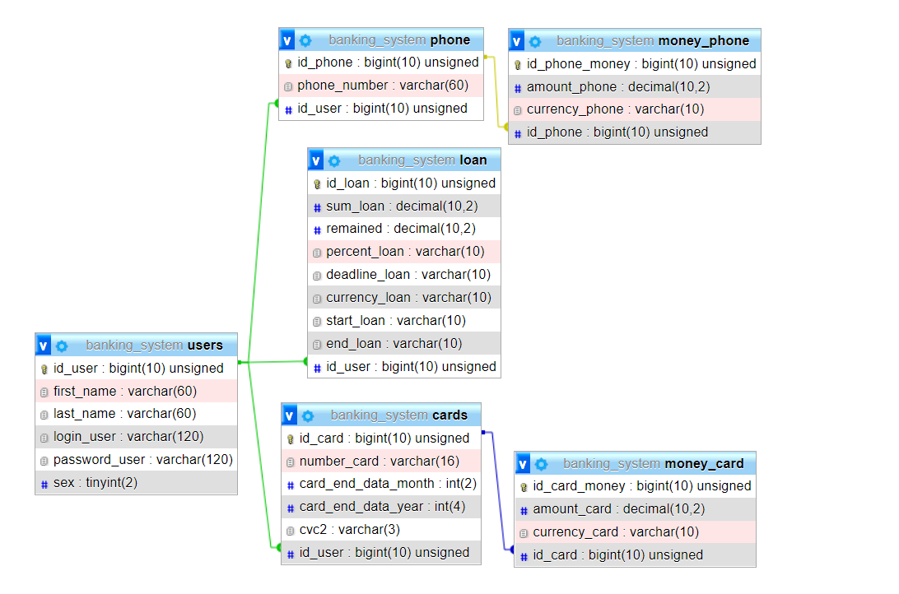

## Diagram business logic
The diagram was created using plugin "plantUML".
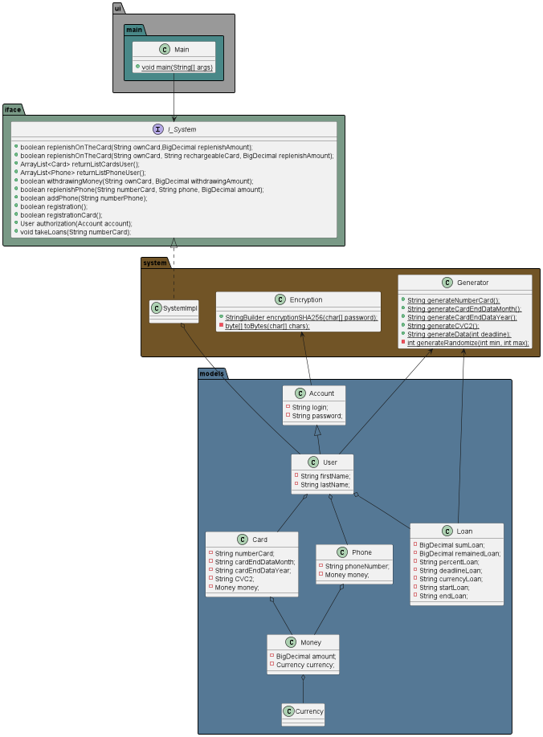

## Program testing
### Main Menu
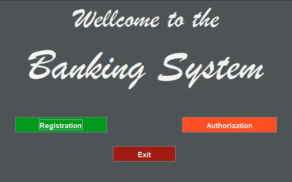
### Authorization
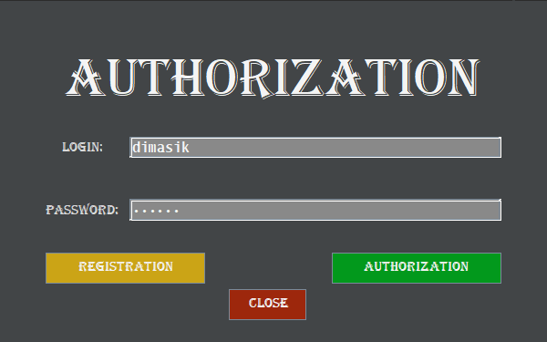
### Registration
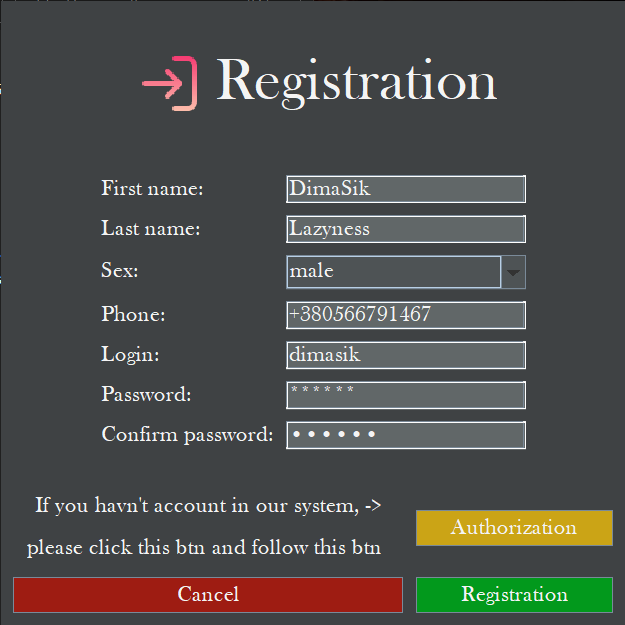
### Register card

### Action Menu
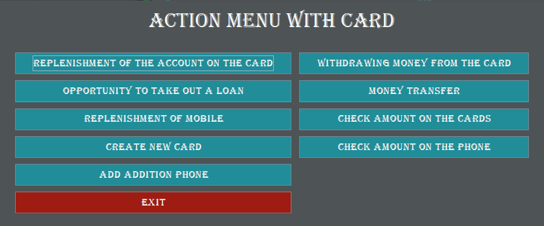
All functions of the action menu will be discussed below.👇
- Replenishment of the account on the card
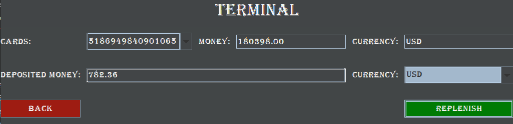
- Withdrawing money from the card
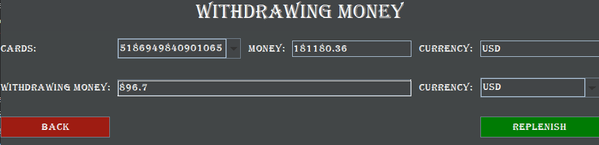
- Opportunity to take out a loan
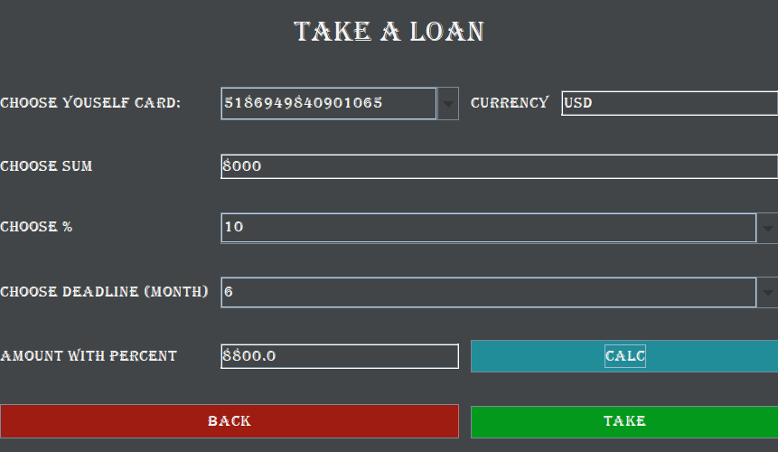
- Money transfer
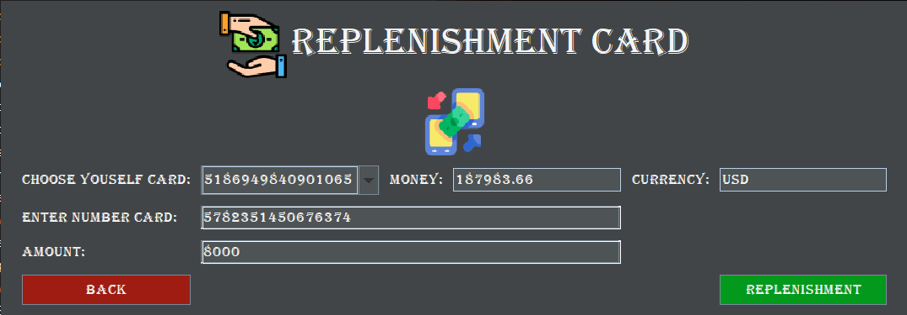
- Replenishment of mobile
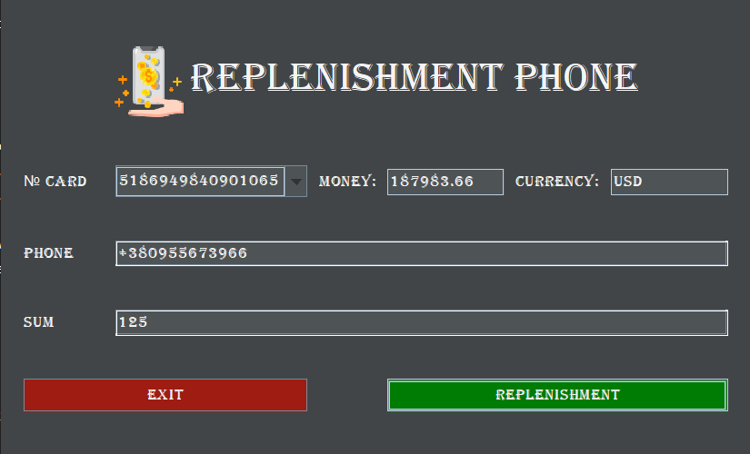
- Add addition phone
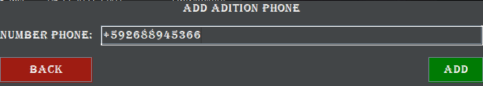
- Check amount on the card
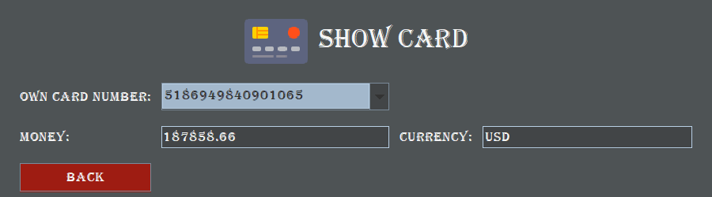
- Check amount on the phone
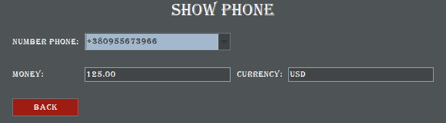

